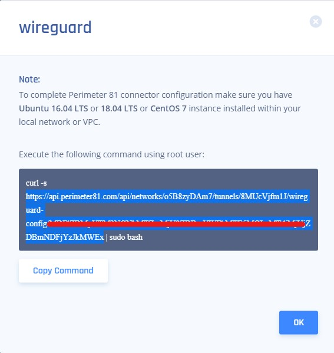
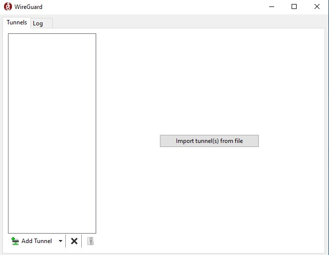
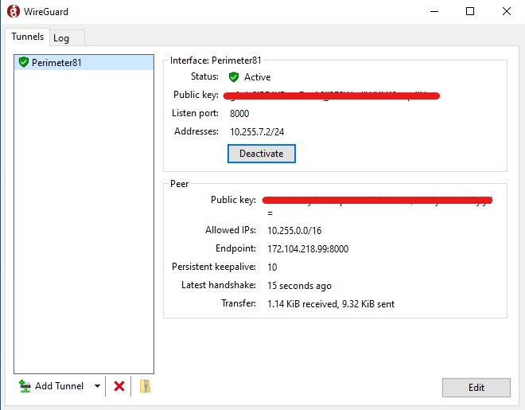

# Wireguard Config Generator for Windows

In the event that a customer chooses to use a windows machine as their wireguard connector, it is possible to install a wireguard peer client.

You can download it from the link below or also get it from this repo:

### 1. Download and install Wireguard for windows
* https://www.wireguard.com/install/
  
### 2. Download the wireguard_generator.exe script

### 3. Get your configuration file from your workspace:
* Click on your wireguard tunnel, go to Configuration
* Copy only the https link portion to your clipboard (everythign after "curl -s" and before "| sudo bash")
* Paste it into a web browser. You should now have a file in your Downloads folder
 
  
 ### 4. Run generator. 
**_NOTE:_** Make sure that the generator script and the configuration file are in the same folder
 
 * Configuration file named Perimeter81.conf should be generated for you in the same folder
  
 ### 5. Import the newly created configuration file into the wireguard connector 
 
 
 ### 6. Activate
 

