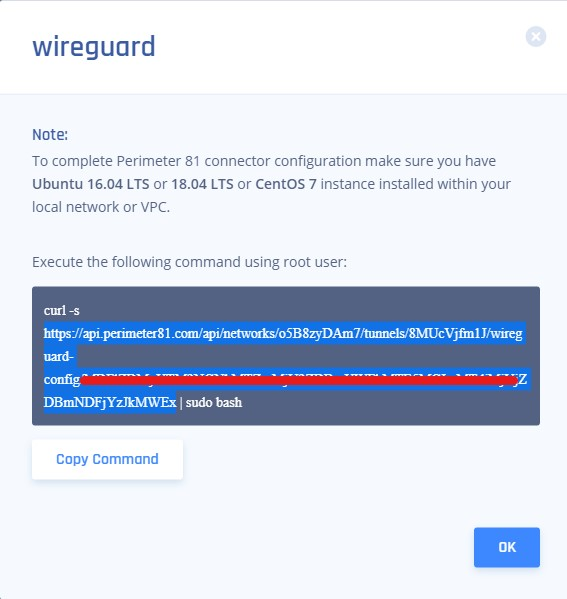
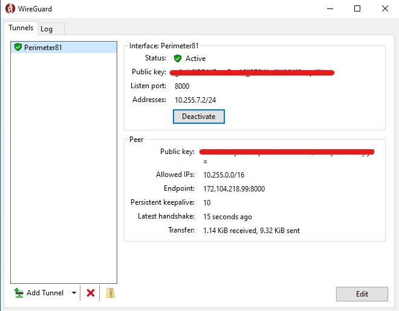

  
  

# Perimeter81 Wireguard Config Generator for Windows 

In the event that a customer chooses to use a windows machine as their wireguard connector, it is possible to install a wireguard peer client.

**_NOTE:_** This script requires windows registry access in order to enable IP Forwarding (IPEnableRouter registry key). Reboot is required

### 1. Download and install Wireguard for windows
* https://www.wireguard.com/install/ or use the included wireguard-installer.exe in this repo, however it might not be the latest version
  
### 2. Get your configuration file from your workspace:
* Click on your wireguard tunnel, go to Configuration
* Copy only the https link portion to your clipboard (everythign after "curl -s" and before "| sudo bash")
* Paste it into a web browser. You should now have a file in your Downloads folder
 
  
 ### 3. Run Wireguard config generator. 
**_NOTE:_** Make sure that the generator script and the configuration file are in the same folder
 
 * Configuration file named **Perimeter81.conf** should be generated for you in the same folder
  
 ### 4. Import the newly created configuration file into the wireguard connector 
 
 
 ### 5. Activate
 

 ### 6. Restart the computer
