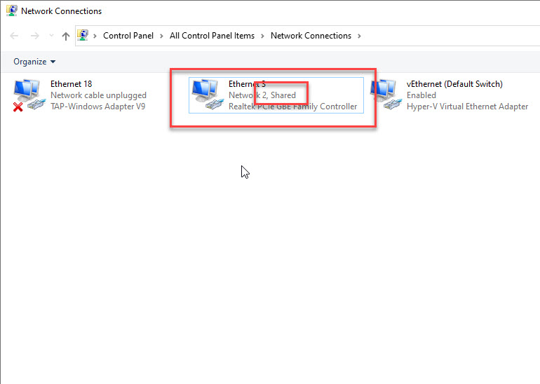

# Perimeter81 Wireguard Config Generator for Windows 

UPDATE!
There is an easier way to do this via a powershell script:

Download it here - https://drive.google.com/file/d/1ZnNJTA0L4moZvgbsCjayjyZYUf8LRPRA/view?usp=sharing

You no longer have to download and install the wireguard installer manually.

In the event that a customer chooses to use a Windows machine as their wireguard connector, the wireguard config generator will help build the required configuration file for easy import and will also make sure that IP forwarding is enabled in Windows. Currently only tested with Windows 10 1909

**_NOTE:_** This script requires windows registry access in order to enable IP Forwarding (IPEnableRouter registry key). Reboot is required

### 1. Download and install Wireguard for windows
* https://www.wireguard.com/install/ or use the included wireguard-installer.exe in this repo, however it might not be the latest version
  
### 2. Get your configuration file from your workspace:
* Click on your wireguard tunnel, go to Configuration
* Copy only the https link portion to your clipboard (everythign after "curl -s" and before "| sudo bash")
* Paste it into a web browser. You should now have a file in your Downloads folder
 
  
 ### 3. Run Wireguard config generator. 
**_NOTE:_** Make sure that the generator script and the configuration file are in the same folder
 * This will generate a file called Perimeter81.conf containing a config of the peer that P81 gateway will allow connections from
 * This also applies a few configuration changes to the registry which are required to enable IP routing and make sure that the ICS will persist a reboot
 * Configuration file named **Perimeter81.conf** should be generated for you in the same folder
  
 ### 4. Import the newly created configuration file into the wireguard connector 
 
 
 
 
 ### 5. Enable Internet Connection Sharing (ICS) on the Main NIC Adapter (the one with the default route)
 
 
 ### 6. Activate (Should be automatic upon restart)

